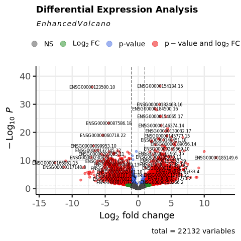

# RNA-seq Differential Expression Analysis: Breast Cancer Tumor vs. Normal
This repository contains the code and documentation for a differential expression analysis pipeline comparing breast cancer tumor tissue with matched normal tissue using TCGA-BRCA RNA-seq data. The workflow leverages Bioconductor packages to identify genes with altered expression in cancer and explore their functional significance.

## Data Source
The analysis uses RNA-seq data from The Cancer Genome Atlas Breast Cancer (TCGA-BRCA) project, accessed programmatically via the TCGAbiolinks package. Instead of processing raw FASTQ files, it is utilized the pre-computed STAR-Counts provided by the GDC, which enables to focus on downstream analysis while maintaining reproducibility.

## Environment Setup
The analysis is performed in a dedicated conda environment running in WSL (Ubuntu 22.04):

```bash
# Create and activate Conda environment
conda create -n rnaseq python=3.13.2
conda activate rnaseq

# Configure bioconda channels
conda config --add channels defaults
conda config --add channels bioconda
conda config --add channels conda-forge

# Install core tools
conda install -y r-base
conda install -y bioconductor-deseq2 bioconductor-enhancedvolcano bioconductor-gseabase bioconductor-apeglm
conda install -y r-ggplot2 r-pheatmap

# Install TCGAbiolinks
if (!requireNamespace("BiocManager", quietly = TRUE))
  install.packages("BiocManager")
BiocManager::install("TCGAbiolinks")
BiocManager::install("SummarizedExperiment")
```

## How to Run
After setting up the environment, you can run the analysis with:

```bash
Rscript scripts/01_data_acquisition.R
Rscript scripts/02_exploratory_analysis.R
Rscript scripts/03_differential_expression.R
Rscript scripts/04_functional_analysis.R
```

## Analysis Workflow
### 1. Data Acquisition
- Query the TCGA-BRCA database to retrieve RNA-seq gene expression data.
- Select 5 matched tumor-normal pairs for a controlled differential expression analysis.
- Download pre-processed count matrices from GDC using the STAR - Counts workflow.
- Convert the data into a RangedSummarizedExperiment object, including sample annotations and metadata.
- Save the dataset for further analysis.

### 2. Exploratory Data Analysis
- Inspect dataset dimensions, sample metadata, and gene annotations for quality control.
- Visualize the distribution of raw gene expression counts to assess data quality.
- Compute sample-wise Pearson correlation and generate a heatmap to evaluate relationships between samples.
- Filter out low-expression genes with a mean count <10 across samples to remove noise.
- Perform Principal Component Analysis (PCA) to examine clustering patterns and identify potential batch effects or outliers.
- Save the filtered dataset for downstream differential expression analysis.

### 3. Differential Expression Analysis
- Normalize raw RNA-seq counts using DESeq2 to correct for sequencing depth differences.
- Fit a statistical model to identify genes with significant expression changes between tumor and normal samples.
- Extract differentially expressed genes (DEGs) using adjusted p-value < 0.05 and log2FoldChange > 1 or < -1.
- Generate a Volcano Plot to visualize the most significant changes in gene expression.
- Save results for downstream functional analysis.

### 4. Functional Analysis
- Gene Ontology (GO) Analysis to identify enriched biological processes, molecular functions, and cellular components in differentially expressed genes.
- KEGG Pathway Analysis to determine biological pathways altered in breast cancer, such as metabolic and signaling pathways.
- Gene Set Enrichment Analysis (GSEA) to identify gene sets that show significant coordinated expression changes across tumor and normal samples.
- Visualization of enriched pathways using bar plots, dot plots, and GSEA enrichment scores.

### Example: Volcano Plot
A volcano plot visualizing differentially expressed genes:



## Repository Structure
- `data/`: Contains downloaded and processed data
- `scripts/`: R scripts for each analysis step
- `results/`: Output files and visualizations
- `docs/`: Documentation and notes

## Dependencies
- R >= 4.0
- Bioconductor packages:
  - TCGAbiolinks
  - SummarizedExperiment
  - DESeq2
  - GenomicRanges
  - EnhancedVolcano
  - clusterProfiler
  - org.Hs.eg.db
  - enrichplot
  - DOSE
- Additional R packages:
  - ggplot2
  - pheatmap

